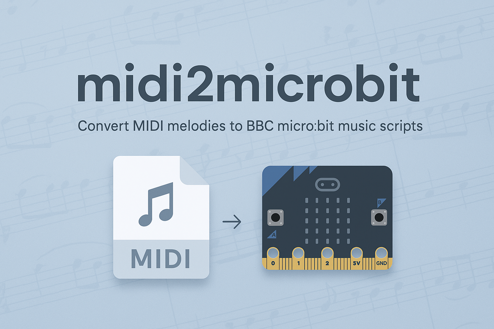

<p align="center">
  
</p>

# 🎵 midi2microbit

Convert MIDI melodies into micro:bit `music.play()` note strings!

This Python script analyzes `.mid` files and outputs note-duration arrays compatible with the `music` module in MicroPython on BBC micro:bit.

---

## ✅ Features

- Detects melody automatically from all tracks
- Converts MIDI note numbers to human-readable note names (e.g. `C4`, `G5`)
- Estimates duration (e.g. `C4:4` = quarter note)
- Outputs a **single `.py` file** ready to upload directly to [python.microbit.org](https://python.microbit.org)

---

## 🎮 Example Output

```python
from microbit import *
import music

melody = [
    'E7:2',
    'E7:2',
    'G7:4',
    ...
]

music.set_tempo(bpm=140)
music.play(melody)
```

---

## 🚀 How to Use

1. Clone this repo or download the files.

2. Put your `.mid` file in the same folder (rename it if needed to match the default name in the script).

3. Run the converter script (for example with cmd from the same folder):
```bash
python midi2microbit_smart.py
```

4. Open or copy-paste the produced code `microbit_final_code.py` in the micro:bit Python editor (https://python.microbit.org/v/3) or Mu editor.

5. Simulate it online (https://python.microbit.org/v/3) or flash it to your micro:bit and enjoy the music!

P.s.: Feel free to email me if you have any trouble or you are a beginner and find difficulties with the steps (info@28x.gr)
---

## 📄 License

MIT License © 2025 Sokratis Dimitriadis
